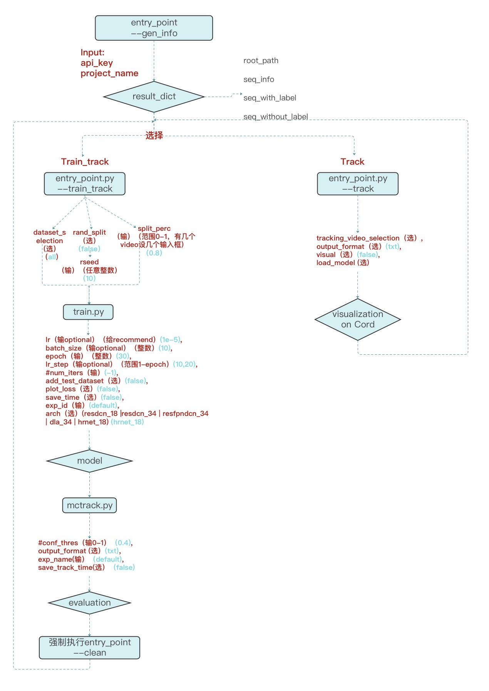

# MscAI Software Engineering Group Project (Group 6)
This is the Imperial College Msc AI group project on multi-object tracking, originating from a proposal made by Imperial's industrial partner Cord AI which also grants access to the object tracking datasets stored on its own Cord platform. 

The project essentially rests upon ifzhang's fundamental approach of FairMOT (Github homepage is [here](https://github.com/ifzhang/FairMOT); paper: [FairMOT: On the Fairness of Detection and Re-Identification in Multiple Object Tracking](https://arxiv.org/pdf/2004.01888v5.pdf)), linking up with the Cord's database and constructing an highly automated pipeline that can enable user to either train new models from scratch or track with existing models (from after the training scheme or pre-trained model downloadable from public URL). It is also worth noting the training-tracking pipeline possesses full multi-class capabilities (multi-class training & evaluation), building onto the powerful MCMOT modifications by CaptainEven whose homepage is: [MCMOT](https://github.com/CaptainEven/MCMOT).

### Some demos/highlights
Highlights on traffic datasets are below:
.gif)

.gif)

Highlights on visdrone datasets are below:
.gif)

### Overall structure of the pipeline

### Configure the environment and build the dockerfile
The entire pipeline is containerised to remove system and environment constraints. As such, we have prepared the dockerfile which includes all the dependencies and packages that are required by the pipeline.
#### Set up the pipeline on a Google Cloud GCP
It is our recommendation that the pipeline is to be run using Google Cloud's computing service. First create a Virtual Machine(VM) instance on Google cloud: check the GPU option and select the operating system to be `Ubuntu 16.04`. Then ssh connect to the VM and install the necessary Nvidia driver (recommended version==418.126.02), Docker as well as Nividia docker for the VM. To check if everything is installed correctly, run the Nividia-smi application:

    docker run --runtime=nvidia --rm nvidia/cuda:9.0-base nvidia-smi

Only with a ready gpu & the driver can the pipeline be properly run on the Google VM. If docker permission error pops up, run the following line:

    sudo chmod a+rw /var/run/docker.sock

Now git clone this repository to the VM folder, and cd to the repository main:

    cd mscai_softwareengineering_project

Then build the docker image:

    sudo docker build -t [image_name]

 This will build a docker image with the name `image_name`

    sudo nvidia-docker run  --ipc=host –it –-name [container_name] –d [image_name] /bin/bash

Running the above command with the `--name` flag will create a container named `container_name`; the `-d` flag will keep the container running at the background. Now you can enter the newly built & up-and-running container with:

    sudo docker exec -ti -u root [container_name] /bin/bash

As we have specified the program's root to be under `/src` in the dockerfile, the above command will bring you directly to the root directory. Now you can essentially run the pipeline unimpeded as if you are on local machine.

#### Set up the pipeline locally
Alternatively, you can choose to set up the pipeline on your local machine. First git clone this repository to your local folder and cd to the main:

    cd mscai_softwareengineering_project

Assuming your local machine has met the GPU/cuda requirements, build the docker image by running:

    docker build -t [image_name]

Now create a container by running(select the image that you have just built):

    docker run –it –-name [container_name] –d [image_name] /bin/bash

Then entering the container will automatically bring you to the program's root:

    docker exec -ti -u root [container_name] /bin/bash

### Means of running the pipeline: CLI or API based 
The entire pipeline is designed to be able to run via two approaches: traditional CLI approach or the more user-friendly API.
- - - -
#### Below are instructions for running the pipeline via a CLI.
- - - -

- [x] CLI approach
- [ ] API approach

#### Check and understand the dataset
The entry point is located inside the `/src` folder which also corresponds to the default root directory of the program.

The first step always is to run the entry point file with `--gen_info` flag to see the important dataset information, facilitating user's decision to run desired pipeline branch with appropriate data and model:

    python3 entry_point.py --gen_info --project [project_id] --api [api_key]

Behind `--project` and `--api` flags you need to enter the project id and api key distributed by Cord. These information must be manually entered because for safety reasons there are no default values for these variables. After this on the command line window you should see key information related to the dataset that is being specified by the projectid-apikey pair, i.e. how many labelled video & unlabelled video does this particular dataset have.

#### Training and tracking
Should the user choose to go through the full length of our pipeline, that is to train a new model and track and evaluate with that model. Under `/src` (root dir) run:

    python3 entry_point.py --train_track --project [project_id] --api [api_key]

Using the `--train_track` flag will move onto the pipeline branch where a new model is trained with architecture, learning rate, epoch number, batch size etc. of user's choosing. Again you still need to manually enter the project id and api key to specify the dataset. Note by default this will train on all video with labels, should the user want to train only on certain video use `--ds` flag to specify the video names(this flag has action "append" meaning it can take multiple arguments in a row).

Then start training by running the `train.py` under `/src`, an example would be:

     python3 train.py --exp_id test_model_1 --arch 'dla_34' --batch_size 3 --num_epochs 10 --lr 1e-5 --lr_step 50

The `--exp_id` will specify the savename of the model after it is trained; `--arch` will specify the architecture of the model; `--batch_size` will specify the batch size parameter for model training dataloader; `--num_epochs` will specify the number of epochs to be used; `--lr` will specify the learning rate of the optimizer; `--lr_step` specify after how many steps would the learning rate be decayed. All these training parameters/hyperparameters have their default optimal values, so you can choose not to bother specifying them. 

After the trained model is saved, should the user want to track video with this model, run the `entry_point.py` again but with the `--track` flag, one example would be:

     python3 entry_point.py --track -vs Video_of_cattle_1.mp4 --specify_model test_model_1 --arch "dla_34"  --visual

The `--vs` flag will specify the name of the video you want to track on; `--specify_model` flag will specify the model to be used for tracking, `--arch` will specify the architecture of that model (note here the necessity of calling `--arch` has been removed as now the pipeline can automatically identify the model architecture from the model name specified). Finally the `--visual` flag will write the tracking results (bounding boxes at each frame) onto the Cord visualizer.

#### Direct tracking
Should the user wants to directly track using a pretrained model or previously-trained model, similar to above, under `/src` (root dir) first run:

    python3 entry_point.py --track -vs Video_of_cattle_1.mp4 --specify_model hrnet_pretrained  --visual

This example code will run tracking with a pretrained model on specified video. Note there is currently one pretrained model supported by the pipeline (will be automatically downloaded at the start), it can be specified by calling the `--specify_model` flag with `hrnet_pretrained`.

- - - -
#### Below are instructions for running the pipeline via a API.
- - - -

- [ ] CLI approach
- [x] API approach

